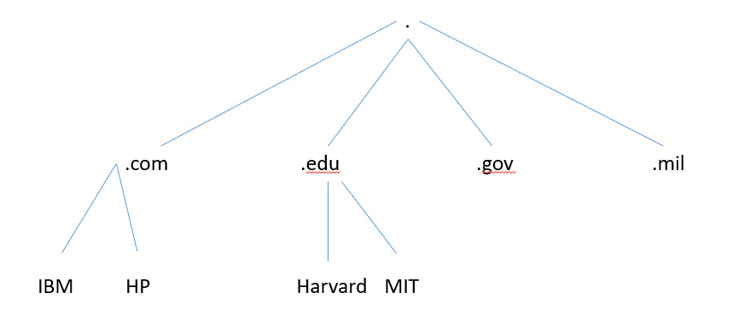

# DNS

DNS is a distributed hierarchical database. At each level of the hierarchy, there is local control of the DNS records, the entire database is available to the whole world, using a client/server model. The servers are called name servers and a single DNS can service many domains. The clients are resolvers, normally some DNS lookup software on a regular client computer. DNS is efficiently available through replication and local caching.

The structure of the DNS database is that of an inverted tree. At the top is the root designated by a “.” and the nodes at the next level of the hierarchy are represented by labels. Each node itself is the root of a new subtree.

<figure><figcaption></figcaption></figure>

The domain name of any node is the list of all the nodes in the subtree listed from leaf to root and separated by “.” as a delimiter. For example, Queen’s University in Belfast has qub.ac.uk as its domain name. The root is a Country Code Top Level Domain (ccTLD) for the UK. The UK segments its namespace into subdomains for academic (ac), companies (co) etc. The final level (qub) is delegated to the university to control and they can populate further subdomains or records into it on demand.&#x20;

The right-most label in a domain name defines the Top-Level Domain (TLD), the hierarchy of domains descends from right to left. In many respects, a domain name is an index to the DNS database, the same way as a folder or directory in a file system allows us to find files. At time of writing there are;&#x20;

* Country-code top-level domains (ccTLD) like .ie&#x20;
* Generic top-level domains (gTLD) like .net and .com&#x20;
* Infrastructure top-level domains like .arpa&#x20;

At time of writing there were over [1,000 TLDs](https://www.iana.org/domains/root/db). In 1998 [ICANN](https://www.icann.org) took over responsibility for the root domains although its continued ownership is contentious. ICANN authoritatively administer the gTLDs. ICANN delegate authority to an organisation in each country to administer the ccTLDs. In Ireland, the .ie domain space is administered by the [IEDR](https://www.iedr.ie/).  
